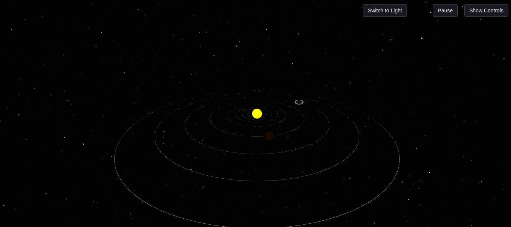

# 🌌 3D Interactive Solar System

A mobile-responsive, interactive 3D model of the solar system built using **Three.js**, featuring realistic planetary orbits, hover tooltips, speed control, dark/light mode, and animation control — all inside a single HTML page.



---

## 🚀 Live Demo

🔗 **[Click to Open the Solar System in Your Browser](https://pranshu-sahu.github.io/solar-system-3d/)**

> No installation needed. Just click and explore!

---

## 🧩 Features

- ☀️ Sun at the center with 8 planets orbiting realistically  
- 🎛️ Real-time **speed sliders** for each planet  
- 🌓 Toggle between **Dark and Light mode**  
- ✨ **Starfield background** to simulate deep space  
- ⏯️ **Pause/Resume** planetary animation  
- 🖱️ **Hover tooltips** show planet names  
- 📱 Fully responsive on mobile and desktop  
- 🖼️ **OrbitControls**: drag, zoom, and pan with mouse or touch  

---

## 📁 Project Structure
/solar-system-3d/
├── index.html # Main file with HTML, CSS, and JS
├── screenshot.png # Screenshot for preview
└── README.md # This file


Everything is bundled in a single HTML file for ease of use and sharing.

---

## ✅ Run Locally (Optional)

If you want to test locally:

1. Clone the repo or download the ZIP
2. Open `index.html` in your browser

Or with VS Code + Live Server:
```bash
code .
# Click "Go Live" from the VS Code bottom bar

🛰️ Deployed on GitHub Pages
This project is live at:
🌐 https://pranshu-sahu.github.io/solar-system-3d/

GitHub Pages serves the static site directly from the index.html.

🙌 Credits
Built using Three.js

Designed & developed by Pranshu Sahu


---

You can copy and save this as `README.md` in your project folder and push it with:

```bash
git add README.md
git commit -m "Add updated README with live demo link"
git push
